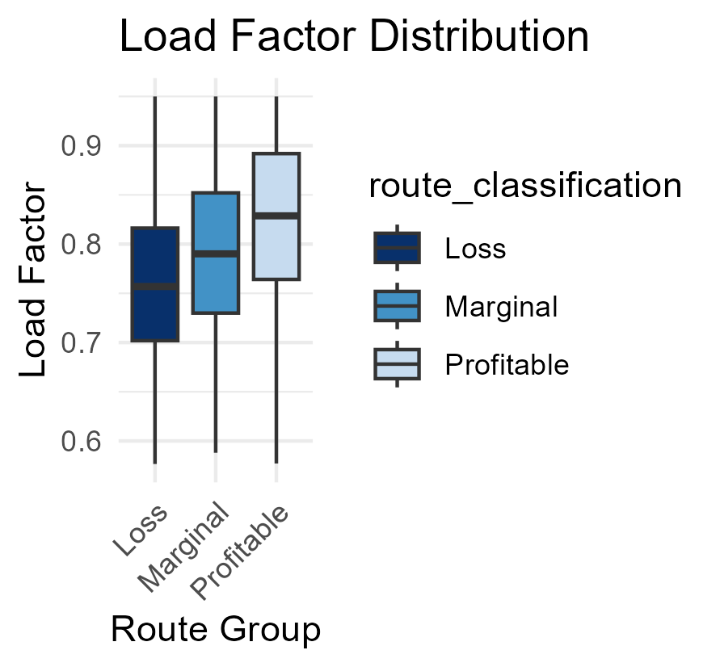
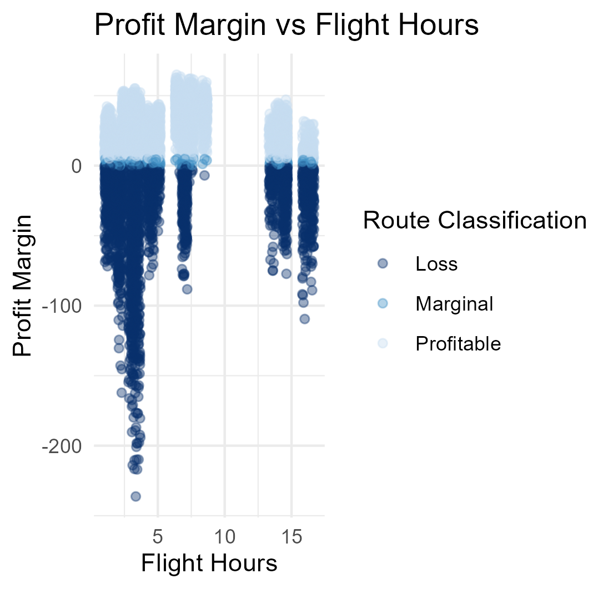
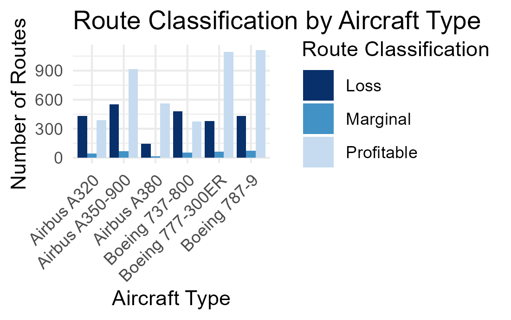
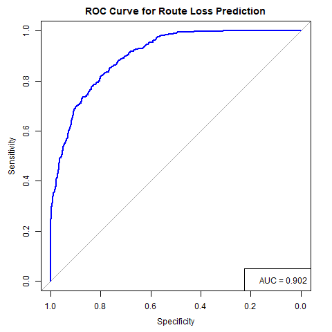

# Airline Route Profitability Analysis

## Research Question
For routes that are not making a profit — do we discontinue or improve pricing strategies? Which routes are consistently losing 
money and why?

## Dataset
- Source: Kaggle — Airline Route Profitability and Cost Analysis
- 7,500+ flight records across 30 routes (2024)
- 6 aircraft types, 33 features including revenue, costs and 
  profitability metrics

## Project Structure
├── airline_route_profitability.csv   # Dataset
├── loss_making_routes_analysis.Rmd   # Full analysis code
├── Airline_route_analysis.Rproj      # RStudio project file
├── aircraft_type.png                  # Output visualisation
├── Load_factor_plot.png
├── profit_margin_plot.png
└── roc_curve_model3.png

## Methods Used
- Exploratory Data Analysis (EDA)
- Logistic Regression (3 models, threshold tuning)
- Decision Tree with cross-validation pruning
- Random Forest (ntree=500, mtry=3)
- Gradient Boosting (GBM with threshold optimisation)

## Key Findings
- **Route Category, Load Factor and Flight Hours** are the primary drivers of route loss across all models
- Short haul routes with load factor below 0.81 recorded a 65.3% loss rate
- Routes DXB-CAI and DXB-AMM identified as worst performing by profit margin
- Aircraft type mismatch (A350-900, Boeing 787-9 on short haul routes) contributes to unnecessary cost inflation

## Model Performance

| Model | Accuracy | Sensitivity | Specificity |
| Logistic Regression (Model 3) | 81.56% | 75.84% | 84.66% |
| Decision Tree (Pruned) | 73.28% | 48.32% | 86.80% |
| Random Forest | 76.62% | 67.56% | 88.84% |
| Boosting (threshold 0.35) | 80.45% | 80.40% | 80.47% |

## Recommendations

| Situation | Recommendation |
| Low load factor + Low demand | Discontinue |
| Low load factor + Medium/High demand | Improve pricing |
| Seasonal loss only | Reduce frequency in off-peak seasons |

## Tools and Packages
- R and RStudio

## Visualisations

### Load Factor Distribution by Route Classification

### Profit Margin Distribution

### Aircraft Type vs Route Classification

### ROC Curve — Best Model

